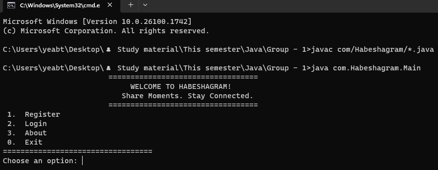

 🌍 Habeshagram - A Simple Social Media Console App  
Group 1 | Package: `com.habeshagram`  

  

 📚 Table of Contents  
- [Features](#features)  
- [Getting Started](#getting-started)  
- [OOP Concepts Used](#oop-concepts-used)  
- [Class Design Overview](#class-design-overview)  
- [Team Members](#team-members)  

 ✨ Features  
- 🔐 User Management – Register, login, and update user profiles  
- 📝 Post Creation – Create both text and image posts  
- 🤝 Social Network – Follow and unfollow other users  
- 💬 Engagement – Comment on user posts  
- 📟 Console Interface – Simple and user-friendly menu system  

 🚀 Getting Started  

# Requirements  
- Java 17 or higher  
- Command line terminal  

# Steps to Run  
1. Compile the Code:  
   javac src/com/habeshagram/*.java -d out/

2. Run the Application:  
   java -cp out com.habeshagram.Main

 🔍 OOP Concepts Used  

| Principle       | Example Implementation                                          |
|-----------------|-----------------------------------------------------------------|
| Encapsulation   | Private attributes with public getters/setters (`User`, `Post`) |
| Inheritance     | `Post` superclass → `TextPost`, `ImagePost` subclasses          |
| Polymorphism    | Overridden `display()` method in different post types           |
| Abstraction     | Abstract `Post` class with shared structure and behavior        |

 🧱 Class Design Overview  

classDiagram
  class User {
    -username: String
    -password: String
    +follow(User user)
    +addPost(Post post)
  }

  class Post {
    <<abstract>>
    #content: String
    #author: User
    +display()
  }

  class TextPost {
    +display()
  }

  class ImagePost {
    -imageUrl: String
    +display()
  }

  class Comment {
    -text: String
    -author: User
  }

  User "1" --> "*" Post
  Post "1" --> "*" Comment
  User "1" --> "*" User : follows

          👨‍💻 Team Members  
 1, YEABTSEGA TESFAYE   => WDU161299  
 2, TESHOME SISAY       => WDU161207  
 3, ETSEGENET DAGNACHEW => WDU160512  
 4, GETASIL SETEGN      => WDU160614  
 5, SAMRAWIT MOLLA      => WDU161055  
 6, TAMENECH MISSA      => WDU161169  

  

